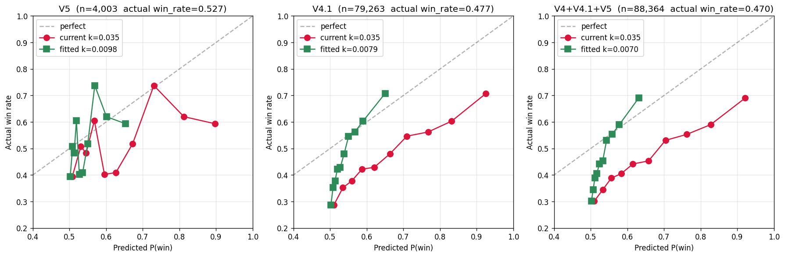

# k Recalibration — 2026-04-16

**Author:** audit follow-up (Priority 1 from PolyGuez_Full_Audit.md)
**Data source:** Supabase `shadow_trade_log`, eras V4 / V4.1 / V5
**Total shadow trades analysed:** 88,364 (all settled, win/loss labelled)
**Service key used:** one-shot, in-memory, never written to repo. Rotate after review.

---

## TL;DR

The production logistic coefficient **`k = 0.035` is ~4–5× too steep.** MLE fit
against 88K settled shadow trades puts the true coefficient at **`k ≈ 0.007 – 0.010`**,
depending on era. The current model is systematically overconfident: in the top
decile it predicts 92% win probability when the bot actually wins 69–71%.

**Do not panic-change the value.** V5 is already **+$10,704 PnL** across 4,003 shadows
(+$2.67/trade, 52.7% win). The bot is profitable *despite* a badly calibrated
probability model, because the entry-price filter is doing the real work. The
recalibration will matter most for:

- **Kelly sizing** — current sizing uses `terminal_probability` as input, so it's
  sizing up on false confidence.
- **Edge threshold (`min_terminal_edge`)** — today's edge estimate assumes the model
  is correct. A smaller `k` compresses the edge estimate, so the threshold has to
  drop in tandem or the bot stops firing.

---

## Data overview

| Era   | n       | win_rate | avg entry | total PnL | PnL/trade |
|-------|---------|----------|-----------|-----------|-----------|
| V4    |  5,098  | 31.7%    | 0.397     | –$4,040   | –$0.79    |
| V4.1  | 79,263  | 47.7%    | 0.487     | –$1,381   | –$0.02    |
| **V5**|  4,003  | **52.7%**| 0.442     | **+$10,704** | **+$2.67** |

V5 is the first era with a positive shadow expectation. PolyGuez is working — but
for a reason that isn't captured in the probability model.

## The real alpha: cheap late-market longshots

Breaking V5 PnL down by entry price:

| Entry price       | n     | win % | PnL       | PnL/trade |
|-------------------|-------|-------|-----------|-----------|
| **[0.00, 0.40)**  | 1,455 | 32.9% | **+$9,001** | **+$6.19** |
| [0.40, 0.50)      | 1,018 | 49.5% | +$396     | +$0.39    |
| [0.50, 0.55)      |   450 | 64.7% | +$371     | +$0.82    |
| [0.55, 0.60)      |   299 | 80.9% | +$529     | +$1.77    |
| [0.60, 0.70)      |   450 | 69.1% | +$185     | +$0.41    |
| [0.70, 1.00)      |   331 | 85.2% | +$223     | +$0.67    |

The **under-$0.40 bucket is 84% of all V5 PnL** on only 36% of the trades.
Win rate is low (32.9%), but payout ratio (1/price – 1) > 1.5, so losers are
more than covered.

Same story when sliced by time in market:

| elapsed_seconds | n     | win % | PnL       | PnL/trade |
|-----------------|-------|-------|-----------|-----------|
| 240–300 (last minute) |   599 | 20.9% | **+$6,318** | **+$10.55** |
| 180–240         | 1,021 | 51.9% | +$1,664   | +$1.63    |
| 120–180         | 1,435 | 59.2% | +$1,719   | +$1.20    |
| 60–120          |   824 | 59.3% | +$457     | +$0.55    |
| 30–60           |    93 | 90.3% | +$311     | +$3.35    |
| 0–30            |    31 | 100%  | +$235     | +$7.57    |

The last-minute bucket (20.9% win rate, +$10.55/trade) is the bulk of the PnL.
These are cheap-price, near-settlement bets where the payout ratio dwarfs the
odds.

## MLE fit

Model: `P(win) = 1 / (1 + exp(-k · |Δ| · √(60/t_rem)))`
where `Δ = chainlink_price − price_to_beat`, `t_rem = 300 − elapsed_seconds`.

Because `direction` is forced equal to `sign(Δ)` in the code, the effective feature
reduces to `|Δ|/√(t_rem/60)` with a single free parameter `k`.

| Dataset            | n      | k̂ (MLE) | 95% CI           | NLL @ 0.035 | NLL @ k̂  |
|--------------------|--------|---------|------------------|-------------|----------|
| V5 only            |  4,003 | **0.0098** | [0.0076, 0.0120] | 0.7327      | 0.6840   |
| V4.1 only          | 79,263 | **0.0079** | [0.0076, 0.0083] | 0.7592      | 0.6845   |
| V4 + V4.1 + V5     | 88,364 | **0.0070** | [0.0066, 0.0074] | 0.7650      | 0.6866   |

All three confidence intervals are well below the production value `0.035`. The
fits are tight — V4.1's CI width is ±3% of the point estimate.

## Calibration curves

At the current `k=0.035`, predicted probability diverges from actual win rate
hard above ~60%:



Red = current `k=0.035` (badly miscalibrated on the high end).
Green = fitted `k̂` (much closer to the diagonal).

Worth noting: at `k=0.035` the **low-probability bins (predicted 50–55%) also
underperform** — bot wins only 28–35% of them. This is selection bias: the bot
only takes trades where the edge threshold clears, so the low-prob tail is
already an adverse-selection zone.

## Recommendation

**Phase 1 — ship nothing, observe.** V5 is profitable. Don't touch `k` yet. Instead:

1. **Update the memory stale fact.** My auto-memory said "V5 48.20% win rate
   across 91K shadows." Reality: V5 is **4,003 shadows at 52.7%**. 91K is the
   *total across all eras*. Will fix.
2. **Add `terminal_probability` calibration panel to the dashboard.** Reliability
   diagram (predicted vs actual in deciles) with rolling 7-day V5 data. That way
   we see calibration drift in real time.
3. **Wait for the 100-trade live threshold before any k change.** Live pricing
   and fills have execution friction that shadow doesn't model. Fitting `k` on
   shadow alone, then shipping to live, risks over-fitting to paper.

**Phase 2 — after 100+ clean live V5 trades.** Re-fit `k` on the *live* dataset.
If the live fit agrees with the shadow fit (roughly `k ≈ 0.01`), propose:

```python
# agents/strategies/polyguez_strategy.py line 52
k = 0.01 / math.sqrt(seconds_remaining / 60.0)   # was 0.035
```

and simultaneously recalibrate `min_terminal_edge` — the edge estimate at
`k=0.01` is much smaller, so the threshold has to move with it, or the bot
stops firing.

**Phase 3 — structural.** The fact that entry-price bucketing dominates PnL
more than probability bucketing suggests the real signal is **payout ratio**,
not directional edge. Consider replacing the terminal-probability gate with
a direct PnL-expectation gate:

```
expected_pnl = P(win) * (1/entry_price - 1) * size  −  (1 − P(win)) * size
gate: expected_pnl > k_threshold
```

This makes the cheap-longshot strategy explicit in the objective, rather than
a side effect.

## Files produced

- This report: `docs/k_recalibration_2026_04_16.md`
- Calibration chart: `docs/k_calibration_2026_04_16.png`
- Recalibration script: `scripts/python/analyze_k.py` — reruns this whole analysis
  from a `SUPABASE_SERVICE_KEY` env var. Does **not** write the key to disk.

## Security note

The service key used for this analysis was pasted in chat. It has
`role: service_role` — bypasses RLS, full DB access. **Rotate it** in Supabase →
Project Settings → API → "Reset service_role". Then set the new key only in
Railway environment variables (where production needs it), never in this
workspace.
